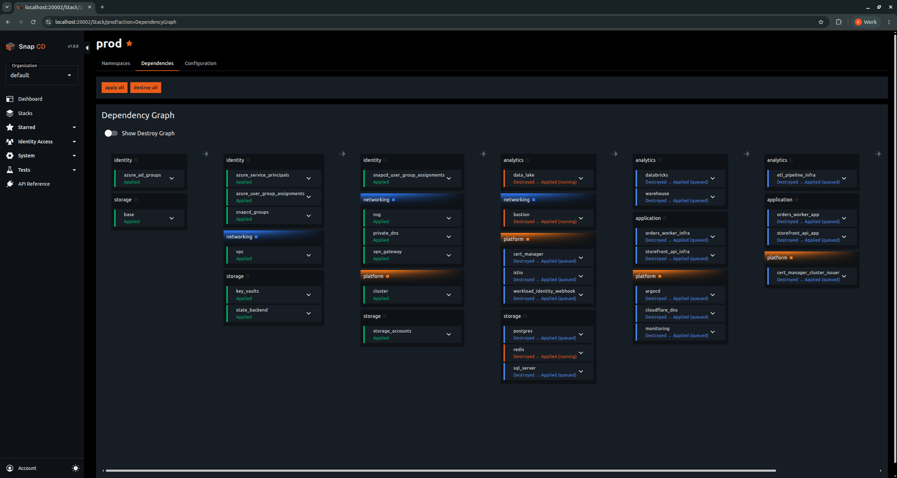

<h1>
  
  Snap CD
</h1>

## Overview
[README.md](README.md)
Snap CD is a self-hostable GitOps orchestrator for Terraform, OpenTofu, and Pulumi. It was built according to (and delivers on!) the following goals:

1. **Break infrastructure into small modules, wired together**, each with its own state file, its own lifecycle, its own blast radius. Outputs from any module automatically become available as inputs to other modules, creating a declarative dependency system across my entire infrastructure.
3. **Have changes propagate automatically**. When my `vpc` module produces a new `private_subnet_id`, downstream modules that consume it should re-plan and re-apply without manual intervention. It should also be a true GitOps orchestrator, meaning new commits or updated configuration should automatically trigger deployment.
3. **Keep my cloud credentials out of the control plane**. The orchestrator should coordinate work, not execute it. Execution should happen on runners I deploy in my own infrastructure. I decide where they run, what access they have, and which modules are allowed to use them. My state files I manage in whatever remote location I am most comfortable with.
4. **Control access granularly**. Infrastructure is organized into stacks (hard boundaries like "prod" and "dev"), then namespaces (logical groupings like "networking" or "storage"), then modules (individual deployments). I need role-based permissions assignable at every one of these levels, whether for service principals or users.
5. **Stay non-invasive. No proprietary runtimes**, no lock-in at the execution layer. Runners should execute standard commands like terraform plan and terraform apply in a normal shell. I should be able to SSH into a runner's working directory and run commands manually if I need to.
6. **Manage everything as code**. A Terraform Provider for the orchestrator itself, so that stacks, namespaces, modules, runners, secrets, role assignments etc. are all defined in HCL.

Those were the initial goals. As the use of AI Coding agents is rapidly becoming the norm (also in the world of infrastructure management) we added a seventh goal:

7. **Use AI to move faster, on a leash I control**. AI should accelerate the tedious parts — diagnosing a failed apply, recommending an approval, putting in a PR for a fix, informing about what is going on — but I decide how much it may do on its own. An agent is just another principal, granted the same scoped permissions as any user, so it never acts beyond the authority I've given it.

  

## Getting started

- **Self-host in minutes:** [Self-hosted quickstart](https://docs.snapcd.io/quickstart/self-hosted/) (Docker Compose).
- **Use the hosted version:** [Cloud quickstart](https://docs.snapcd.io/quickstart/cloud/).
- **Manage Snap CD resources as code:** the [Snap CD Terraform provider](https://registry.terraform.io/providers/schrieksoft/snapcd/latest/docs). Deploy this [sample project](https://github.com/snapcd-samples/sample-deployment) against your self-hosted Snap CD instance to see it in action.
- **Full documentation:** [docs.snapcd.io](https://docs.snapcd.io).

## Architecture at a glance

- **Server** (`SnapCd.Server.Host`) — dashboard, API, and run orchestration.
- **Runner** (`SnapCd.Runner`) — per-environment worker; connects back over SignalR and runs the engines inside your account.
- **Agent** (`SnapCd.Agent`) — per-environment AI worker; runs diagnosis/approval/summary missions against an LLM (via MCP). *(Enterprise)*
- **Contracts / Core** (`SnapCd.Contracts`, `SnapCd.Server.Core`) — shared DTOs and server logic, published to NuGet.

Container images are published to GHCR on every release (`ghcr.io/schrieksoft/snapcd/…`); see the [self-hosting guide](https://docs.snapcd.io/self-hosting/).

## Contributing

- **Build, run, and contribute:** [`CONTRIBUTING.md`](./CONTRIBUTING.md).
- **Bugs & feature requests:** GitHub Issues.
- **Security:** [`SECURITY.md`](./SECURITY.md) — please report privately, never in a public issue.
- **Code of conduct:** [`CODE_OF_CONDUCT.md`](./CODE_OF_CONDUCT.md).

## Editions

Source-available under the **Snap CD Source-Available License 1.1** ([`LICENSE.md`](./LICENSE.md)). A free **Community** tier runs without a license key; paid tiers raise quotas and unlock additional features — see [Pricing](https://snapcd.io/Pricing).
